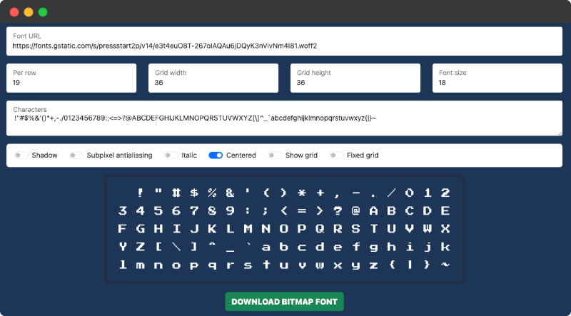

# Font To Bitmap Converter

This tool allow to convert web **fonts** into **bitmap fonts**.

It accepts both types of URL:

- **stylesheet** URL: `https://fonts.googleapis.com/css2?family=Press+Start+2P`
- **direct** URL of font: `https://fonts.gstatic.com/s/pressstart2p/v14/e3t4euO8T-267oIAQAu6jDQyK3nVivNm4I81.woff2`

## Live

- https://stmn.itch.io/font2bitmap
- https://stmn.github.io/font2bitmap

## Technicals

Under the hood project uses: Vite, Bootstrap 5, AlpineJS 

- Dev: `npm run dev`
- Build: `npm run build`

